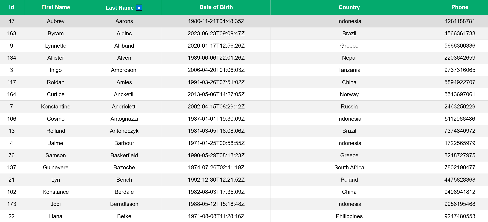
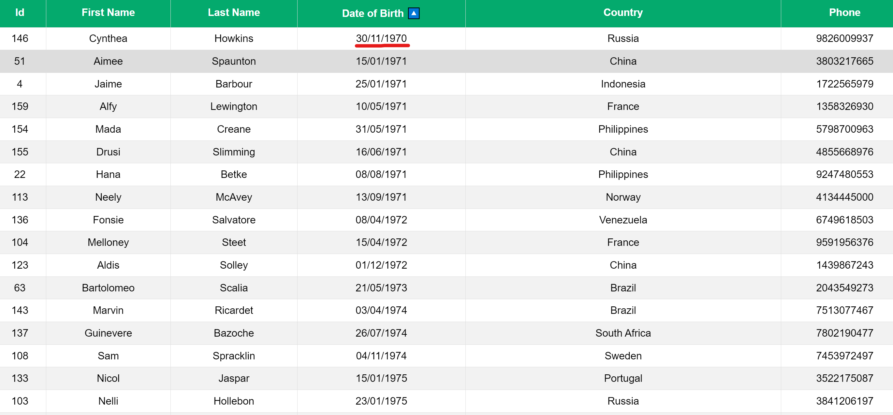
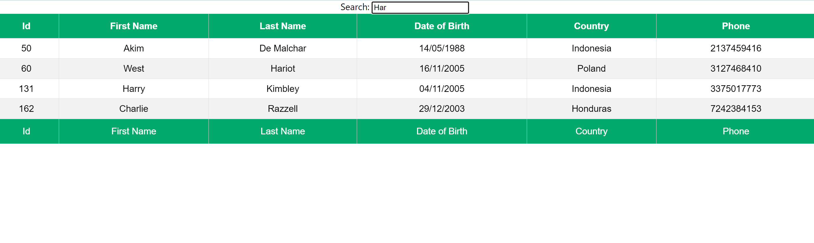
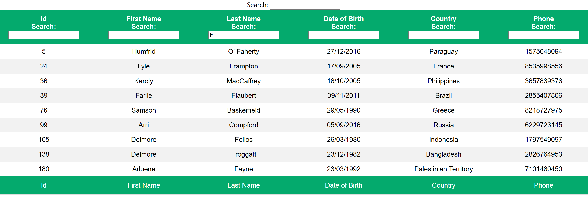
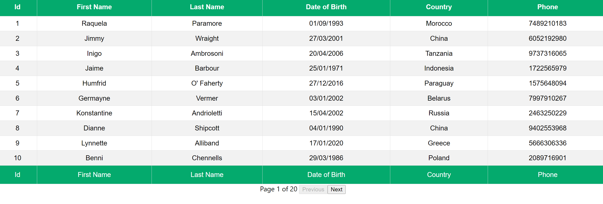
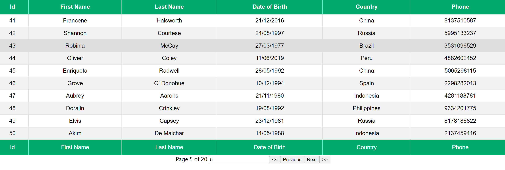
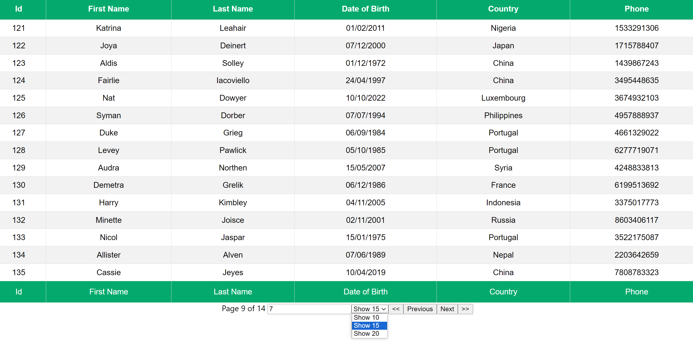
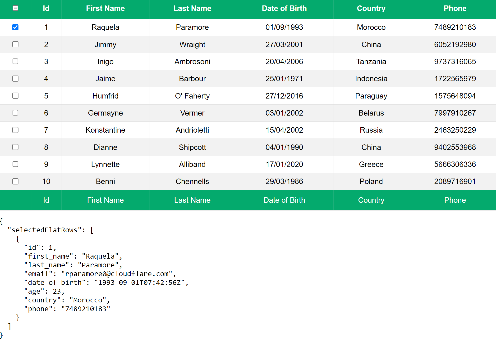

# React Table Course

### Создание таблицы сортировки

### Создание таблицы сортировки с отформатированной датой в формате `dd/MM/yyyy`

### Создание таблицы с глобальным фильтром

### Создание таблицы с колоночным фильтром

### Создание таблицы с простой пагинацией

### Создание таблицы с пагинацией goto page

### Создание таблицы с пагинацией page size 

### Создание таблицы с выбираемыми строками 

